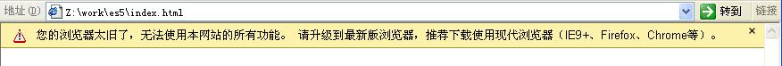

## 浏览器监测 至少IE8
> 主要检测用户的浏览器是否为现代浏览器（IE7+），至少是IE8。主要表现为：低于IE8以下的浏览器会弹出提示，提醒用户升级浏览器。


<body>
 <!-- 此js须放在body的底部... -->
  
</body>


## 浏览器监测ECSAM 5 特性提醒
> 主要检测用户的浏览器是否为现代浏览器（IE8+），是否支持ECSAM Script 5的特性。主要表现为：低于IE9以下的浏览器会弹出提示，提醒用户升级浏览器。

## 效果

{:width="100%"}

## 适用范围
具有需要使用es5特性的脚本框架，例如：[VUEjs](http://cn.vuejs.org/){:target="_blank"}

## web 使用方法

**注意：** 在 `body` 的最底部中引入脚本:（可默认使用 https ）


<body>
 <!-- 此js须放在body的底部... -->
  
</body>


## 其他参考
由于 Vue.js 是基于Object.defineProperty实现数据追踪，故不支持IE8及更低版本的浏览器。
因此，用Object.defineProperty来判断是否为现代浏览器。

